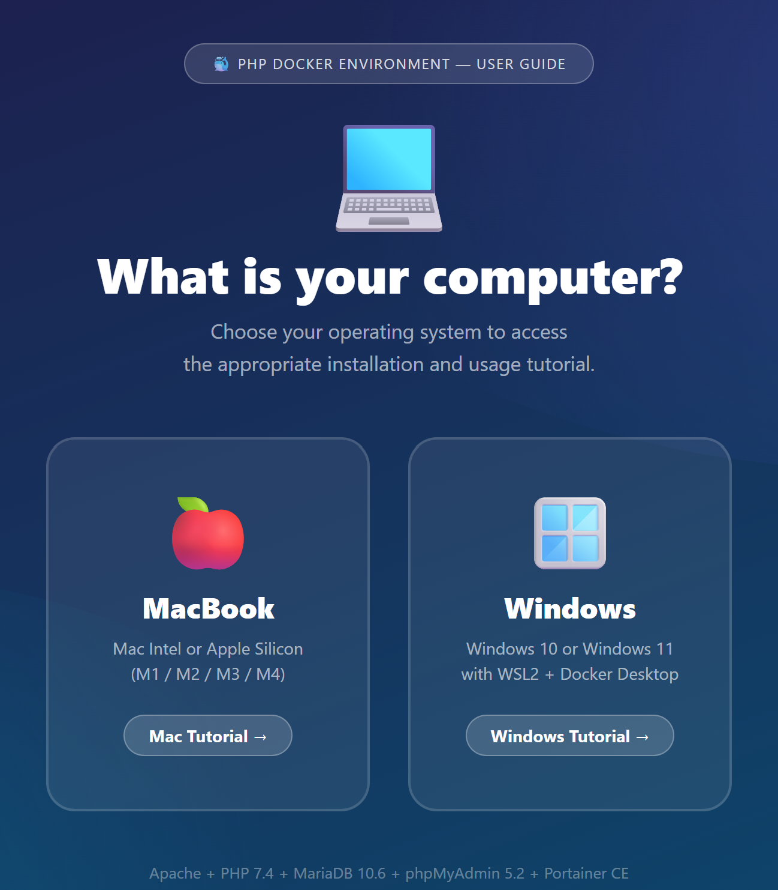

<p align="center">
  
</p>

<h1 align="center">PHP Docker Environment</h1>

<p align="center">
  <strong>XAMPP equivalent — ready to use, zero configuration.</strong><br>
  Apache 2.4 · PHP 7.4 · MariaDB 10.6 · phpMyAdmin · Portainer
</p>

<p align="center">
  
  
  
  
  
</p>

---

## Setup — 3 steps

### 1. Install Docker Desktop (once)

Download and install [Docker Desktop](https://www.docker.com/products/docker-desktop) for your system.

> **Windows**: install WSL2 before Docker. In PowerShell (admin): `wsl --install` then restart.

### 2. Download this project

**Option A — Without Git (beginners)**

1. On this page, click the green **`<> Code`** button (top right)
2. Click **`Download ZIP`**
3. Open the downloaded ZIP file
4. **Extract** (unzip) the folder to your **Desktop**
5. Name the folder **`PHPenv`**

**Option B — With Git**

```bash
cd ~/Desktop
git clone https://github.com/selinachegg/php-docker-environment.git PHPenv
```

### 3. Launch

| System | Command |
|--------|---------|
| **Windows** | Double-click `start.bat` |
| **Mac** | Double-click `start.command` |

> **Mac — first time only**: open Terminal and type `chmod +x start.command stop.command`

The first launch takes **5 to 10 minutes** (downloading images). After that: **~10 seconds**.

---

## Your services

| Service | URL | Description |
|---------|-----|-------------|
| 🌐 **PHP Site** | [localhost:8080](http://localhost:8080) | Your PHP files (`htdocs/` folder) |
| 🗄️ **phpMyAdmin** | [localhost:8081](http://localhost:8081) | Visual database management |
| 🐳 **Portainer** | [localhost:9000](http://localhost:9000) | Visual Docker container management |
| 🏠 **Dashboard** | [localhost:8082](http://localhost:8082) | Home page with all links |

---

## Working with PHP

Your PHP files go in the **`htdocs/`** folder. Changes are **instant** — no restart needed.

```php
<?php
// htdocs/hello.php → http://localhost:8080/hello.php
echo "Hello world!";
?>
```

### Database connection

```php
<?php
$pdo = new PDO(
    "mysql:host=db;dbname=app;charset=utf8mb4",
    "app",   // username
    "app"    // password
);
?>
```

| Parameter | Value |
|-----------|-------|
| Host | `db` |
| Database | `app` |
| Username | `app` |
| Password | `app` |
| Root password | `root` |

---

## Stop the environment

| System | Command |
|--------|---------|
| **Windows** | Double-click `stop.bat` |
| **Mac** | Double-click `stop.command` |

> Your PHP files and database data are preserved.

---

## Full tutorial

Open the [**Interactive tutorial (HTML)**](tutorials/STUDENT-TUTORIAL.html) in your browser for the complete step-by-step guide (Mac and Windows).

PDF versions are also available in the **`tutorials/`** folder:
- [Tutorial Mac (PDF)](tutorials/Tutorial%20%E2%80%94%20PHP%20Docker%20Environment%20Mac.pdf)
- [Tutorial Windows (PDF)](tutorials/Tutorial%20%E2%80%94%20PHP%20Docker%20Environment%20Windows.pdf)

---

## Quick troubleshooting

| Problem | Solution |
|---------|----------|
| Portainer shows "timeout" | **Windows**: double-click `reset-portainer.bat`. **Mac**: `docker compose restart portainer`. Then go to localhost:9000 immediately. |
| Docker is not running | Open Docker Desktop, wait for the green whale icon, then run the script again. |
| localhost:8080 not responding | Wait 30 seconds (database starts last) then refresh (F5). |
| phpMyAdmin connection error | MariaDB takes 10-20s to start. Wait and refresh. |
| [Mac] "Permission denied" | `chmod +x start.command stop.command` |
| [Win] start.bat closes instantly | Right-click → "Run as administrator" |
| Full reset | `docker compose down -v` then run the script again |

---

## Tech stack

- **PHP** 7.4 — PDO, MySQLi, GD, ZIP, MBString, OPcache
- **Apache** 2.4 — mod_rewrite enabled
- **MariaDB** 10.6 — 100% MySQL compatible
- **phpMyAdmin** 5.2
- **Portainer** Community Edition
